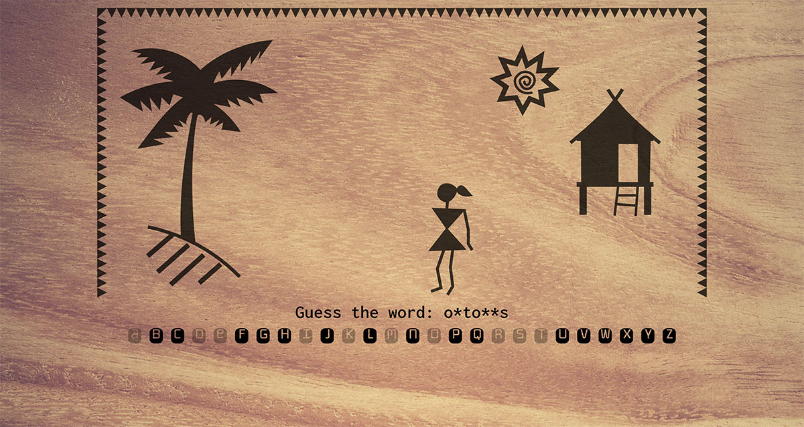

# Hangwoman
My tropical version of Hangman, a childhood pen and paper game favorite.

## General Info
This is a demo project that I did to get more experience in DOM manipulation. At the same time I wanted to make it visually pleasing as well as play around with a bit of SVG animation. It was important for me to retain the style of the stick figure drawing, so as to keep the connection with the source of inspiration. This project also taught me a lot about designing an intuitive interface.

## Technologies Used
JavaScript, CSS and HTML. I also did the (vector) illustrations using Affinity Designer.

## Features
It's an online game and pretty straighforward. I think the visuals (with animations) and the sounds add to its charm. It's fully responsive and can be played using both mouse and keyboard.

## Screenshot

## Usage
The words to guess are hard coded in the JavaScript file. One could of course choose to use an online dictionary API as an alternative source, but since I specifically wanted to use words that had a link to "tropical island living" I chose to hand-pick these words.
Live demo of the game can be found here: https://rubberducky.rocks/projects/hangwoman/.
